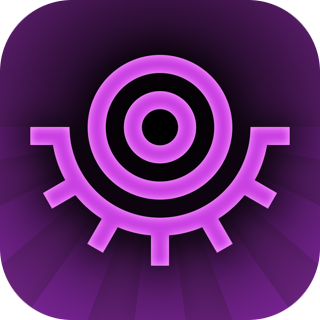

*NOTE: I am in the middle of a large refactor of this codebase. What is committed here is an older version than what I have on disk. Expect the structure to change significantly soon.*

# I Keep Having This Dream
TODO add f-droid badge once app gets approved
<!--  -->
<!--  -->

#### **I Keep Having This Dream** is a strategy-roguelike game for Android.

Alex, if you see this: send me a message.

# Description

In this innovative puzzle RPG, build a path of tiles to escape each successive cycle of your dreamscape. A cycle gets more dangerous the longer you stay, so plan your route carefully, and make the most of the challenges and opportunities you meet along the way.

Place tiles to boost your attack and defence, defeat enemies to level up your character, and upgrade the right perks to stay safe as your ever-present enemies grow stronger. Take a detour off the direct pathway to discover items that may give you an edge, but watch out for the powerful special enemies that grow more frequent as you near the exit - if left untended, their powerful abilities will quickly spell your doom.

# Features

* 25+ upgradeable perks to augment and focus your strategy
* 150+ items to collect and boost your stats
* 100+ special enemies to encounter and overcome
* 80+ one-off events to choose from for a temporary boost
* Unlock more enemies, events, and cosmetics over several playthroughs

# Screenshots

[TBA]

# Building from Source

[TBA]

# Contributing

[TBA]

# Credits

This game is a full ground-up rewrite of the iOS app "I Keep Having This Dream" by Fireflame Games, which disappeared from the App Store sometime around 2018 and is no longer available anywhere. This was one of my favourite games to play and kill time with when I was younger, so when I wanted to play it a couple months ago I was shocked to see it had practically become unplayable lost media. I managed to find a copy of the game's assets (textures, sounds) from an old phone backup, and took on the project of rebuilding the entire game for Android using the given assets + the few screenshots and videos I was able to find online. This has been in the works for a long time, and I'm happy to share it with the open-source community.

* **Alex Kuptsov**, for the now-lost iOS original.
* **libsdl**, for SDL and SDL-mixer
* **kcat**, for OpenAL-soft